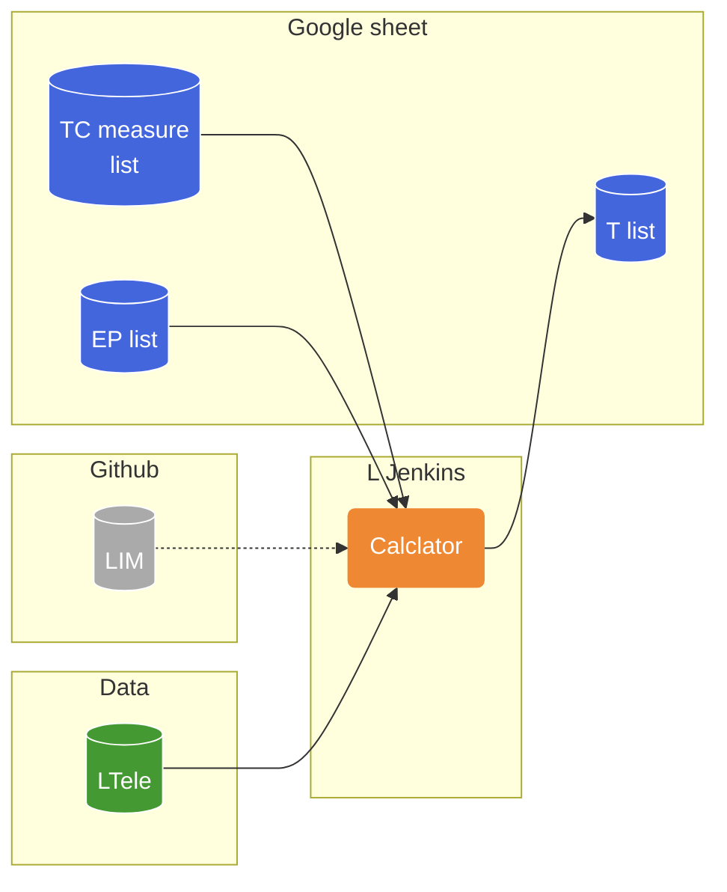

# アーキ

# Specification
以下の仕様のjenkins job. codeはgitに持つ。

Input
- build parametor
- Google sheet
    - TC
    - EP
- Data

Output
- Google sheet
    - T list
- Build artifact

# Data schema
## TC
- app name
- TCname
- TCID
- Priority
- Conditions

## EP
- app name
- Conditions
