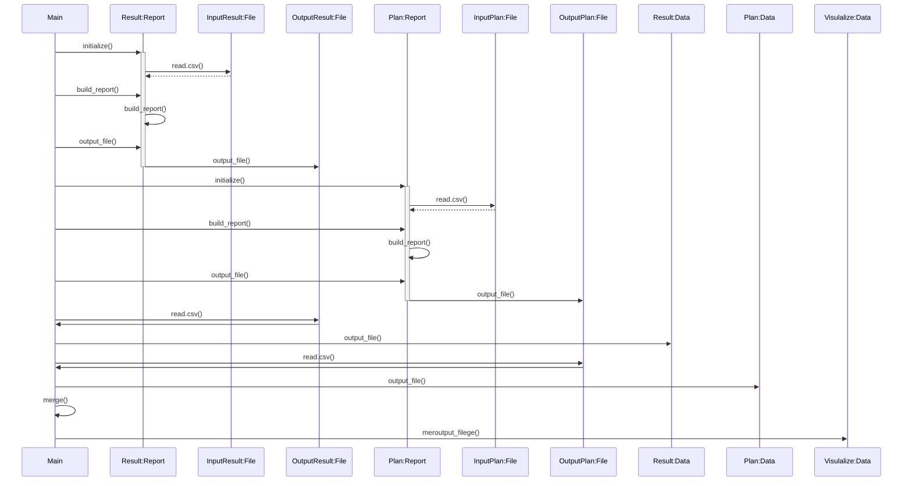

```mermaid
sequenceDiagram
  participant M as Main
  participant R as Result:Report
  participant RIF as InputResult:File
  participant ROF as OutputResult:File
  participant P as Plan:Report
  participant PIF as InputPlan:File
  participant POF as OutputPlan:File
  participant RD as Result:Data
  participant PD as Plan:Data
  participant MD as Visulalize:Data
  M->>+R: initialize()
  R->>RIF: read.csv() 
  RIF-->>R: 
  M->>R: build_report()
  R->>R: build_report()
  M->>R: output_file()
  R->>-ROF: output_file()

  M->>+P: initialize()
  P->>PIF: read.csv() 
  PIF-->>P: 
  M->>P: build_report()
  P->>P: build_report()
  M->>P: output_file()
  P->>-POF: output_file()

  M->>ROF: read.csv() 
  ROF->>M: 
  M->>RD: output_file() 
  M->>POF: read.csv() 
  POF->>M: 
  M->>PD: output_file() 
  M->>M: merge()
  M->>MD: meroutput_filege()

```