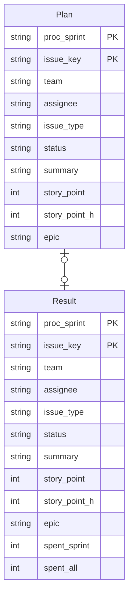

# Sprint performance dashboard

## Overview
Measures the velocity of each sprint based on issues registered in Jira and displays it on the dashboard.
(link)

## Datas retrieved from Jira 
At the start(plan) and end(result) of each sprint, Jira data is collected and stored as the following data.
From these data, sprint result are measured using each metric.

Note: These data are extracted from the Jira export file using this script.

## Items displayed on the dashboard

### Key metrics for sprint velocity
The following metrics are calculated and displayed based on each item listed in [Results for each issue](#results-for-each-issues-) below.

| Name | Description                                                                                                                                                            |
|------|------------------------------------------------------------------------------------------------------------------------------------------------------------------------|
| SP   | Planned Point. Planned story point value at the start of the sprint.                                                                                                   |
|      | Accepted Point. Point value accepted in ths Sprint. Measure the value for Planned points and the value for all points accepted in the Sprint.                          |
|      | Accepted Ratio. Percentage of Accepted points in the sprint point value. Measure for planned points and for all points in the sprint.                                  |
|      | Accepted Spent. Time spent on accepted in ths Sprint. Measure for planned points and for all points in the sprint.                                                     |
|      | Cost performance index. Cost performance value for accepted issues. Calculated by dividing point by spent.  Measure for planned points and for all points in a sprint. |

### Results for each issues 
Display the join data of Plan and Result mentioned above in each item below.

(Join condition) 
__Full join__ Plan.sprint = Result.sprint and Plan.issue_key = Result.issue_key 

| Name       | Description                                                                                              |
|------------|----------------------------------------------------------------------------------------------------------|
| assignee   | Displays the value of _Result.assignee_. If it does not exist, display the value of _Plan.assignee_.     |
| issue_key  | Displays the value of _issue_key_.                                                                       |
| summary    | Displays the value of _Result.summary_. If it does not exist, display the value of _Plan.summary_.       |   
| issue_type | Displays the value of _Result.issue_type_. If it does not exist, display the value of _Plan.issue_type_. |
| status     | Displays the value of _Result.status_. If it does not exist, display the value of _Plan.status_.         |
| planned    | Displays __Yes__ if _Plan_ data with _issue_key_ exists, otherwise displays __No__.                      |
| sp(plan)   | Displays the value of _Plan.story_point_h_ in bar format.                                                |
| sp(result) | Displays the value of _Result.story_point_h_ in bar format.                                              |
| spent      | Displays the value of _spent_sprint_ in bar format.                                                      |

